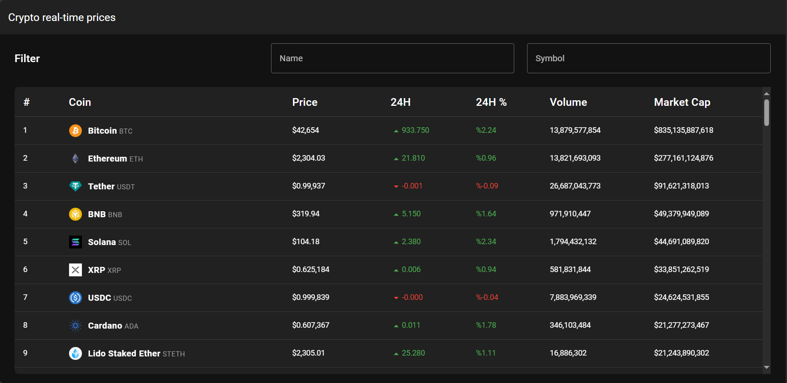
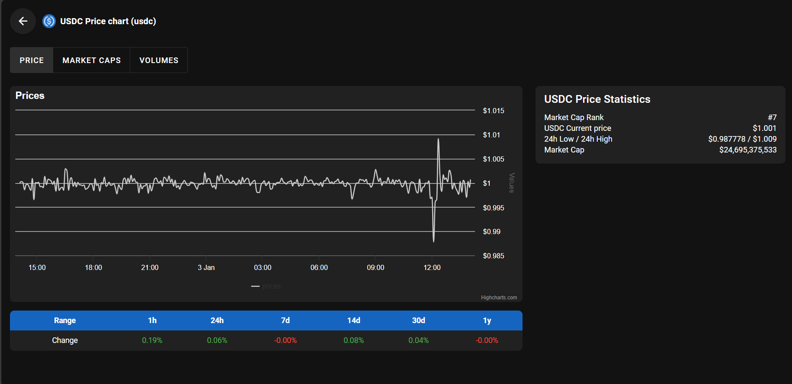

# Crypto dashboard





## Overview
This project is a Vue 3 application utilizing the Composition API with `<script setup>` syntax. The structure is organized to facilitate modularity and separation of concerns, making use of components, composables, endpoints, plugins, and other Vue-specific design conventions.

## Project Structure

The project is organized into several directories, each with a specific type of file:
- `assets`: This folder contains static files, such as images and global stylesheets.
- `components`: This directory houses Vue components that are used across different parts of the application.
  - `DetailPage`: Components specific to the detail page.
  - `Main`: Components used within the main section of the site.
- `composables`: Here you'll find composition functions (often referred to as composables) that encapsulate reactive logic which can be reused across components.
- `endPoints`: Contains TypeScript files defining API endpoints for HTTP requests.
  - `apis.ts`: Exports functions for API calls used within the application.
- `fakeData`: If present, this would include mock data for testing or development purposes.
- `helpers`: Utility functions and constants that are used throughout the application.
  - `highchartOptions.ts`: Provides configurations for Highcharts charts used within the app.
  - `index.ts`: Collects and exports helpers from the `helpers` directory.
- `layouts`: Vue components that define different layout structures.
  - `default`: A set of default layout components.
- `plugins`: Vue plugins and additional third-party integrations or global components.
  - `vuetify.ts`: Integration of Vuetify UI components.
- `router`: Vue Router definitions and routes.
- `states`: State management.
  - `errorState.ts`: State handling for application-wide errors.
- `styles`: SCSS files containing styling variables and mixins.
- `views`: Vue components representing entire pages.
  - `CoinDetail.vue`: A view for coin details.
  - `Home.vue`: The home page view.

## Usage

To start using this project, clone the repo and install the dependencies:

## Project setup

```
# pnpm
pnpm install
```

### Compiles and hot-reloads for development

```
# pnpm
pnpm dev
```

### Compiles and minifies for production

```
# pnpm
pnpm build
```

### Customize configuration

See [Configuration Reference](https://vitejs.dev/config/).
